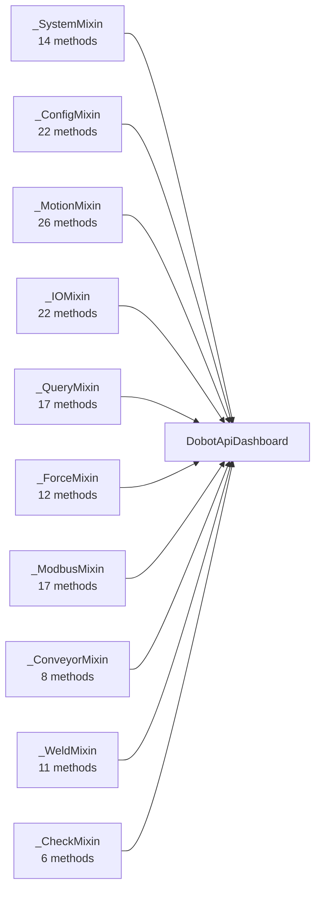
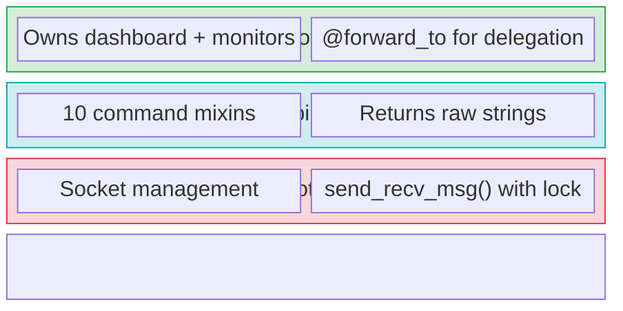

# Architecture Deep-Dive

This page explains the internal design decisions behind the SDK's architecture. For a quick overview, see [Architecture Overview](../getting-started/architecture.md).

## Why Mixin Composition?

The Dobot V4 protocol defines ~155 commands across 10 functional categories. Putting all of these in a single class would create a monolithic file with thousands of lines. Instead, the SDK organizes commands into focused mixin classes:



These are composed via multiple inheritance into `DobotApiDashboard`:

```python
class DobotApiDashboard(
    _CheckMixin,
    _WeldMixin,
    _ConveyorMixin,
    _ModbusMixin,
    _ForceMixin,
    _QueryMixin,
    _IOMixin,
    _MotionMixin,
    _ConfigMixin,
    _SystemMixin,
    _SerializationMixin,
    DobotApi,
):
    ...
```

### Benefits

1. **Separation of concerns**: Each file is self-contained and testable independently.
2. **Discoverability**: Users can find all I/O commands in `_io_mixin.py`, all motion commands in `_motion_mixin.py`, etc.
3. **Parallel development**: Multiple developers can work on different mixins without merge conflicts.
4. **Testing**: Unit tests are organized by mixin, each verifying command strings and aliases.

### MRO (Method Resolution Order)

Python's C3 linearization ensures a predictable method resolution order. `DobotApi` is always last in the MRO, so all mixins can call `self.send_recv_msg()` which is defined on `DobotApi`.

## The Serialization Mixin

`_SerializationMixin` provides a shared utility for building protocol command strings:

```python
# Inside a mixin method:
cmd = self._build_command("EnableRobot", load, center_x, center_y, center_z)
return self.send_recv_msg(cmd)
```

This avoids duplicating string formatting logic across 155 methods.

## Thread Safety

`DobotApi.send_recv_msg()` acquires a lock before sending and blocks until a reply is received:

```python
def send_recv_msg(self, string: str) -> str:
    with self._lock:
        self.send_data(string)
        return self.wait_reply()
```

This means:
- Multiple threads can share a single `DobotApiDashboard` instance safely.
- Only one command is in-flight at a time — commands are serialized.
- Feedback connections are separate sockets and do not contend with the dashboard lock.

## The Three-Layer Design



**Layer 1 (`DobotApi`)** handles raw TCP: connect, send bytes, receive bytes, reconnect.

**Layer 2 (`DobotApiDashboard`)** builds protocol command strings and returns raw response strings. This layer knows the Dobot protocol grammar but doesn't interpret responses.

**Layer 3 (`DobotRobot`)** adds:
- Automatic resource management (context manager)
- Pure delegation to dashboard methods (which return typed values)
- Lazy feedback and error monitor lifecycle
- Convenience methods combining multiple operations

This separation means experienced users can drop to Layer 2 for full protocol access, while the default experience at Layer 3 is safe and ergonomic.
