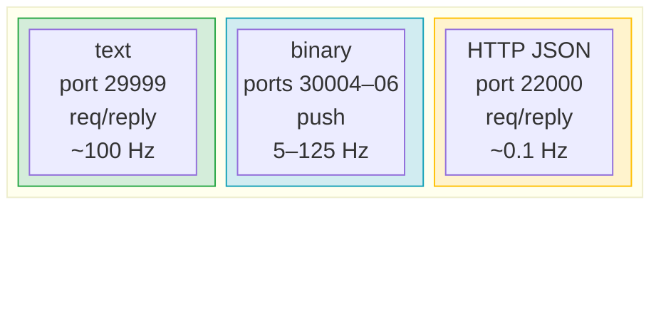

# Why Five Ports?

The Dobot V4 controller uses five separate network ports for communication. This page explains the design rationale behind this separation.

## The Fundamental Trade-off

Robot control requires two fundamentally different communication patterns:

1. **Request/Reply** — send a command, wait for a response-. Low frequency, variable latency.
2. **Push Stream** — receive continuous state updates. High frequency, fixed timing.

Mixing these on a single connection creates problems: a large command response could delay a time-critical feedback packet, or a flood of feedback data could starve command processing.

## Port 29999: Dashboard (Request/Reply)

The dashboard port handles all robot commands. It follows a strict request/reply protocol:

- Client sends a text command: `"EnableRobot()"`
- Server replies with a text response: `"0,1;"`
- Only one request is in-flight at a time

This is simple, debuggable (you can use telnet), and naturally serialized. The lock in `send_recv_msg()` ensures thread safety.

**Why text, not binary?** Text commands are human-readable, making protocol debugging straightforward. The performance cost is negligible since commands are infrequent (typically < 100/s).

## Ports 30004/30005/30006: Feedback (Push Stream)

Feedback ports push binary data at fixed intervals:

| Port  | Rate    | Use Case                    |
| ----- | ------- | --------------------------- |
| 30004 | 125 Hz  | Servo control loops         |
| 30005 | 5 Hz    | Monitoring, UI updates      |
| 30006 | Custom  | Application-specific needs  |

**Why three feedback ports?**

Different applications need different update rates:

- **Servo control** (ServoJ/ServoP) requires 125 Hz to match the command cycle. Using port 30004 ensures the control loop has the freshest data.
- **Monitoring UIs** only need 5 Hz. Using port 30005 avoids wasting bandwidth and CPU parsing 125 packets/second when you only need 5.
- **Custom applications** might need an intermediate rate. Port 30006 is configurable for this.

Each port is an independent TCP connection, so a slow consumer on port 30005 cannot back-pressure port 30004.

**Why binary, not text?** Feedback packets contain 65+ numeric fields totaling 1440 bytes. Binary encoding is compact and fast to parse with numpy. Text encoding would balloon packet size and parsing time at 125 Hz.

## Port 22000: Error Monitor (HTTP)

Error and alarm information is served via HTTP JSON on port 22000. This is separated from the dashboard for several reasons:

1. **Different protocol**: HTTP is stateless and well-tooled. You can query it from a browser, curl, or any HTTP client.
2. **Different lifecycle**: Error monitoring can run independently of command sessions. A monitoring dashboard can poll alarms without holding a TCP connection on port 29999.
3. **No contention**: Alarm polling does not interfere with command execution or feedback streams.

## Lazy Connection Strategy

`DobotRobot` creates connections on demand:

| Connection   | When Created                | Port  |
| ------------ | --------------------------- | ----- |
| Dashboard    | `__init__()` (always)       | 29999 |
| Error Monitor| `__init__()` (always)       | 22000 |
| Feedback 30004 | First access to `robot.feedback` | 30004 |
| Feedback 30005 | First access to `robot.feedback_30005` | 30005 |
| Feedback 30006 | First access to `robot.feedback_30006` | 30006 |

This saves resources: if you only need to send commands, no feedback sockets are opened. Each feedback port adds a persistent TCP connection that continuously receives data.

## Summary

The separation ensures each communication pattern gets the protocol and timing characteristics it needs, without interference between them.
