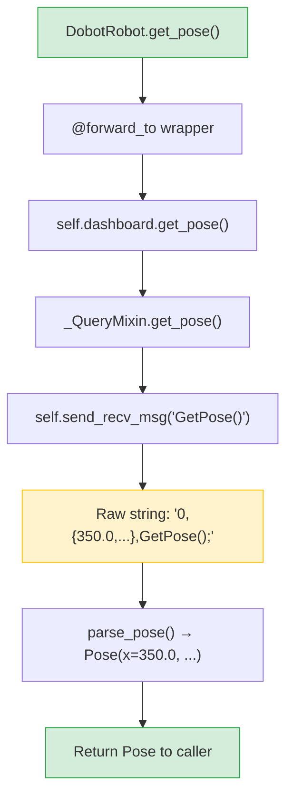

# The @forward_to Decorator Explained

The `@forward_to` decorator is the mechanism that connects the high-level `DobotRobot` facade to the underlying `DobotApiDashboard` command methods. It performs **pure delegation** — the dashboard mixin methods themselves handle all response parsing.

## The Problem

Without `@forward_to`, every forwarded method on `DobotRobot` would look like this:

```python
class DobotRobot:
    def enable_robot(self, load=0.0, ...) -> None:
        return self.dashboard.enable_robot(load, ...)

    def get_pose(self, user=-1, tool=-1) -> Pose:
        return self.dashboard.get_pose(user, tool)

    # ... repeated for every forwarded method
```

This is boilerplate: every method has the same pattern of delegate to dashboard. With 25+ forwarded methods, this becomes verbose and error-prone.

## The Solution

```python
@forward_to(DobotApiDashboard.enable_robot, type(None))
def enable_robot(self, load=0.0, ...) -> None:
    """Enable the robot."""
    ...
```

The decorator replaces the method body at decoration time. The `...` (Ellipsis) is the original body — it is never executed. Instead, the decorator creates a wrapper that:

1. Looks up `self.dashboard`
2. Calls `self.dashboard.enable_robot(*args, **kwargs)` (same method name)
3. Returns the result unchanged

Because the dashboard mixin methods already parse TCP responses into typed Python values (`None`, `int`, `Pose`, `tuple[int, ...]`, `str`), the decorator performs **no additional parsing**.

## Implementation

The full decorator is concise:

```python
def forward_to(dashboard_method, return_type=None):
    method_name = dashboard_method.__name__

    def decorator(method):
        @functools.wraps(method)
        def wrapper(self, *args, **kwargs):
            target = self.dashboard
            return getattr(target, method_name)(*args, **kwargs)

        # Metadata for introspection / documentation tooling
        wrapper.__forward_target__ = "dashboard"
        wrapper.__forward_method__ = method_name
        if return_type is not None:
            wrapper.__forward_return_type__ = return_type

        return wrapper
    return decorator
```

Key details:

- **`dashboard_method.__name__`** is captured at decoration time, so the wrapper knows which dashboard method to call.
- **`functools.wraps`** preserves the original docstring and signature for documentation and IDE support.
- **`return_type`** is stored as metadata for introspection — it is not used at runtime.
- The first argument is an **unbound method** (e.g., `DobotApiDashboard.enable_robot`), not a string.

## How the Dashboard Parses Responses

The actual response parsing happens inside each mixin method. For example `_QueryMixin.get_pose()` calls `self.send_recv_msg()`, splits the raw string, and returns a `Pose` dataclass. The `@forward_to` decorator simply delegates to this already-parsed result.



## Return Types by Category

| Category      | Return Type       | Example Method      |
| ------------- | ----------------- | ------------------- |
| Ack-only      | `None`            | `enable_robot()`    |
| Command ID    | `int`             | `mov_j()`           |
| Scalar value  | `int`             | `robot_mode()`      |
| Pose          | `Pose`            | `get_pose()`        |
| Error IDs     | `tuple[int, ...]` | `get_error_id()`    |

## Design Trade-offs

### Advantages

- **DRY**: The delegation pattern is defined once.
- **Type safety**: The return type is declared in both the decorator metadata and the type annotation, enforcing consistency.
- **Extensibility**: Adding a new forwarded method is just one decorated stub.

### Limitations

- **Implicit delegation**: The method body is never called, which can be confusing to readers unfamiliar with the pattern. The `...` body is a convention, not a requirement.
- **Subset only**: Only ~25 of ~155 dashboard methods are forwarded. For the rest, users must access `robot.dashboard` directly.
- **Signature coupling**: The `DobotRobot` method must have the same parameter names as the dashboard method for forwarding to work correctly.

## Adding a New Forwarded Method

To forward a new dashboard method to `DobotRobot`:

```python
@forward_to(DobotApiDashboard.new_command, type(None))
def new_command(self, param1: int, param2: float) -> None:
    """Description of the new command."""
    ...
```

Requirements:
1. A method with the **same name** must exist on `DobotApiDashboard`.
2. Set the `return_type` to match what the mixin method actually returns (`type(None)`, `int`, `Pose`, `tuple`, etc.).
3. Document the method — the docstring is preserved by `functools.wraps`.
