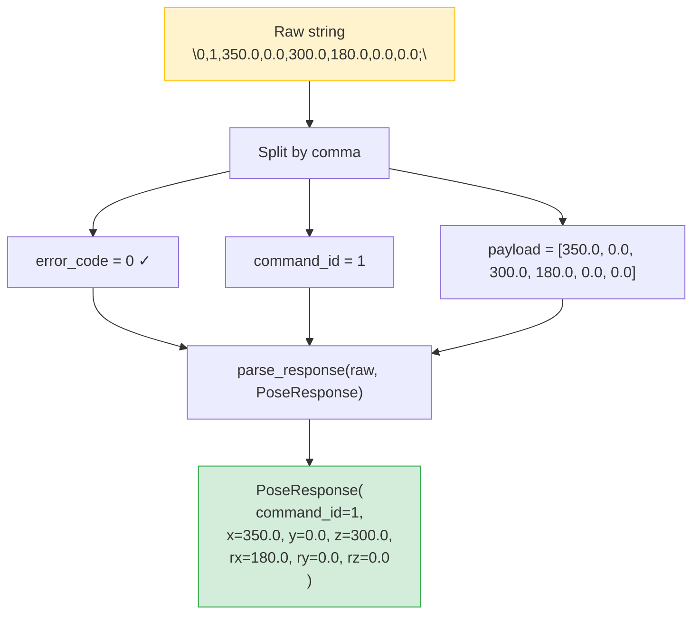

# The @forward_to Decorator Explained

The `@forward_to` decorator is the mechanism that connects the high-level `DobotRobot` facade to the underlying `DobotApiDashboard` command methods while adding automatic response parsing.

## The Problem

Without `@forward_to`, every forwarded method on `DobotRobot` would look like this:

```python
class DobotRobot:
    def enable_robot(self, load=0.0, ...) -> AckResponse:
        raw = self.dashboard.enable_robot(load, ...)
        return parse_response(raw, AckResponse)

    def get_pose(self, user=-1, tool=-1) -> PoseResponse:
        raw = self.dashboard.get_pose(user, tool)
        return parse_response(raw, PoseResponse)

    # ... repeated for every forwarded method
```

This is boilerplate: every method has the same pattern of delegate-then-parse. With 25+ forwarded methods, this becomes verbose and error-prone.

## The Solution

```python
@forward_to("dashboard", AckResponse)
def enable_robot(self, load=0.0, ...) -> AckResponse:
    """Enable the robot."""
    ...
```

The decorator replaces the method body at decoration time. The `...` (Ellipsis) is the original body — it is never executed. Instead, the decorator creates a wrapper that:

1. Looks up `self.dashboard` (the `target_attr`)
2. Calls `self.dashboard.enable_robot(*args, **kwargs)` (same method name)
3. Passes the raw string result through `parse_response(raw, AckResponse)`
4. Returns the typed dataclass

## Implementation

The full decorator is concise:

```python
def forward_to(target_attr, response_type):
    def decorator(method):
        method_name = method.__name__

        @functools.wraps(method)
        def wrapper(self, *args, **kwargs):
            target = getattr(self, target_attr)
            raw = getattr(target, method_name)(*args, **kwargs)
            return parse_response(raw, response_type)

        return wrapper
    return decorator
```

Key details:

- **`method.__name__`** is captured at decoration time, so the wrapper knows which dashboard method to call.
- **`functools.wraps`** preserves the original docstring and signature for documentation and IDE support.
- **`getattr(self, target_attr)`** allows the decorator to be generic — it works for any sub-object, not just `dashboard`.

## The Response Parsing Pipeline

The `parse_response()` function takes a raw string and a target type:



If the error code is non-zero, `parse_response` raises `DobotApiError`.

## Design Trade-offs

### Advantages

- **DRY**: The delegate-then-parse pattern is defined once.
- **Type safety**: The return type is declared in both the decorator and the type annotation, enforcing consistency.
- **Extensibility**: Adding a new forwarded method is just one decorated stub.

### Limitations

- **Implicit delegation**: The method body is never called, which can be confusing to readers unfamiliar with the pattern. The `...` body is a convention, not a requirement.
- **Subset only**: Only ~25 of ~155 dashboard methods are forwarded. For the rest, users must access `robot.dashboard` directly and parse manually.
- **Signature coupling**: The `DobotRobot` method must have the same parameter names as the dashboard method for forwarding to work correctly.

## Adding a New Forwarded Method

To forward a new dashboard method to `DobotRobot`:

```python
@forward_to("dashboard", AckResponse)
def new_command(self, param1: int, param2: float) -> AckResponse:
    """Description of the new command."""
    ...
```

Requirements:
1. A method with the **same name** must exist on `DobotApiDashboard`.
2. Choose the appropriate response type (`AckResponse`, `IntResponse`, `PoseResponse`, or `ErrorIdResponse`).
3. Document the method — the docstring is preserved by `functools.wraps`.
