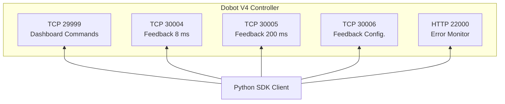
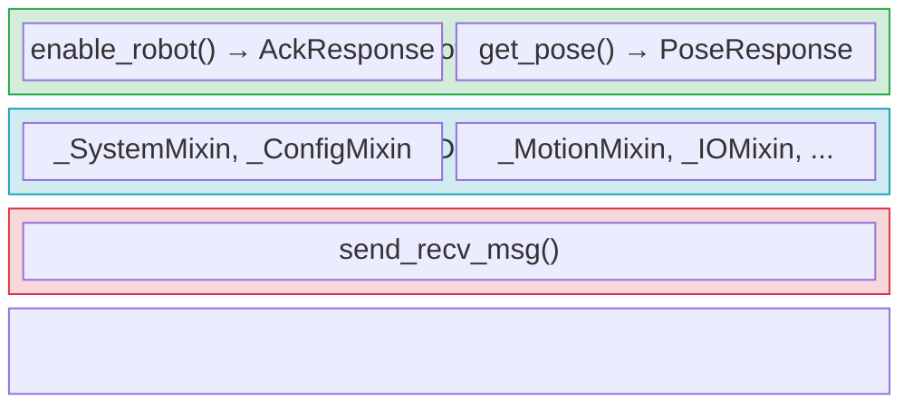
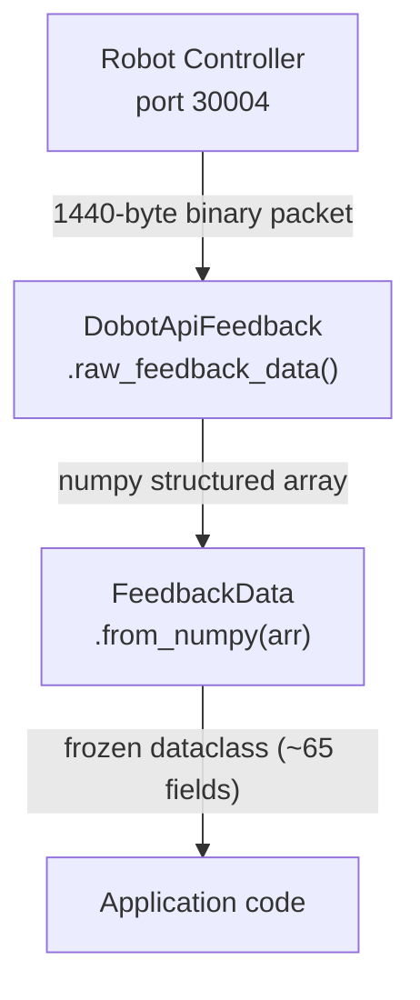

# Architecture Overview

This page describes the high-level architecture of the Dobot V4 Python SDK — how connections are organized, how commands flow through the system, and how the code is structured.

## Connection Model

The Dobot V4 controller exposes five network ports:

| Port  | Protocol   | Direction       | Purpose                              |
| ----- | ---------- | --------------- | ------------------------------------ |
| 29999 | TCP (text) | Request/Reply   | Send commands, receive responses     |
| 30004 | TCP (bin)  | Server → Client | Real-time feedback at 8 ms cycle     |
| 30005 | TCP (bin)  | Server → Client | Real-time feedback at 200 ms cycle   |
| 30006 | TCP (bin)  | Server → Client | Real-time feedback, configurable     |
| 22000 | HTTP JSON  | Request/Reply   | Error/alarm information              |

## Layered Design

The SDK is organized in three layers:

### Layer 1: `DobotApi` — Base TCP

The base class manages a single TCP socket. It provides `send_recv_msg(command)` which sends a text command string and returns the raw response. This method is thread-safe (protected by a lock).

### Layer 2: `DobotApiDashboard` — Command Mixins

`DobotApiDashboard` inherits from `DobotApi` and all 10 command mixins via multiple inheritance:

- **`_SystemMixin`** — enable, disable, power on, emergency stop, reset
- **`_ConfigMixin`** — speed, acceleration, coordinate systems, collision, safety
- **`_MotionMixin`** — MovJ, MovL, ServoJ, Arc, Jog, relative motions
- **`_IOMixin`** — digital/analog I/O, tool I/O
- **`_QueryMixin`** — robot mode, pose, error IDs, kinematics
- **`_ForceMixin`** — force/torque sensor, force compliance mode
- **`_ModbusMixin`** — Modbus TCP/RTU communication
- **`_ConveyorMixin`** — conveyor tracking
- **`_WeldMixin`** — arc welding, weave patterns
- **`_CheckMixin`** — motion pre-checking for reachability

Each mixin method builds a protocol command string (e.g., `"EnableRobot()"`) and calls `self.send_recv_msg()` to send it. Methods return raw response strings.

### Layer 3: `DobotRobot` — High-Level Facade

`DobotRobot` is the recommended entry point. It wraps:

- A `DobotApiDashboard` instance (port 29999)
- A `RobotErrorMonitor` instance (HTTP port 22000)
- Lazy `DobotApiFeedback` instances (ports 30004, 30005, 30006)

It exposes a subset of dashboard commands via the `@forward_to` decorator, which automatically:
1. Delegates the call to the dashboard method
2. Parses the raw string response
3. Returns a typed dataclass (`AckResponse`, `PoseResponse`, etc.)

## Response Types

All `DobotRobot` methods return frozen dataclasses:

| Response Type     | Fields                                      | Used By                |
| ----------------- | ------------------------------------------- | ---------------------- |
| `AckResponse`     | `command_id`                                | Most commands          |
| `IntResponse`     | `command_id`, `value`                       | `robot_mode()`         |
| `PoseResponse`    | `command_id`, `x`, `y`, `z`, `rx`, `ry`, `rz` | `get_pose()`        |
| `ErrorIdResponse` | `command_id`, `error_ids`                   | `get_error_id()`       |

## Backward Compatibility

Every command method has two names:

- **`snake_case`** (primary): `enable_robot`, `mov_j`, `get_pose`
- **`PascalCase`** (alias): `EnableRobot`, `MovJ`, `GetPose`

The aliases are simple assignments: `EnableRobot = enable_robot`. Use `snake_case` in new code.

## Feedback Data Flow

Feedback ports push binary packets at fixed intervals. Each packet is 1440 bytes, parsed via a numpy dtype (`FeedbackDtype`) into a structured array, then optionally converted to a frozen `FeedbackData` dataclass.

## What's Next

- [Connection Model Explained](../explanation/connection-model.md) — why five ports?
- [Architecture Deep-Dive](../explanation/architecture.md) — mixin composition pattern in detail
- [The @forward_to Decorator](../explanation/forward-decorator.md) — response parsing pipeline
